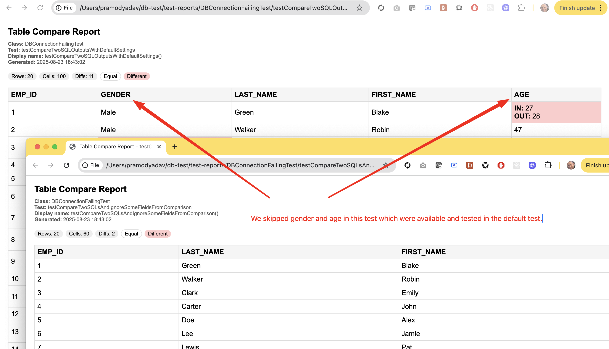

# db-test

db-test is a lightweight framework that allows to do a functional test compare of sql statement outputs. The test results for each test are then presented in a html file that gives a csv style, row by row compare between source and target records.

> [!NOTE]  
> Build is expected to fail to showcase failure test reports.

[](https://github.com/PramodKumarYadav/db-test/actions/workflows/ci.yml)

## Why db-test?

Comparing results of two SQL statements is easy using open source solutions such as JDBC. Asserting them with standard test libraries such as Junit5 or TestNg is also possible. However, if we use traditional test reports such as surefire or allure for these kind of tests, the output result from such assertions is hardly intutive or useful.

In context of sql output comparisons, a csv representation that highlights the differences for each row/cell feels intutive.

db-test framework does exactly that.

## Getting Started

### Prerequisites

- Java 17 or higher
- Maven

### Setup

Clone the repository:

```sh
git clone https://github.com/PramodKumarYadav/db-test.git
cd db-test
```

### Run Tests

To run all tests:

```sh
mvn clean test
```

### Test Results

To serve the full test report run:

```sh
mvn -q allure:serve
```

> [!IMPORTANT]  
> From each test, you can go to detailed reports by clicking on the icons as shown in below image.


> [!TIP]
> The detailed html test results are also accessible directly from the `test-reports` directory.

Here are a few samples of how the reports can look like with different settings.

1. Report with all fields compared.
   
2. Report with a few fields skipped from comparison.
   
